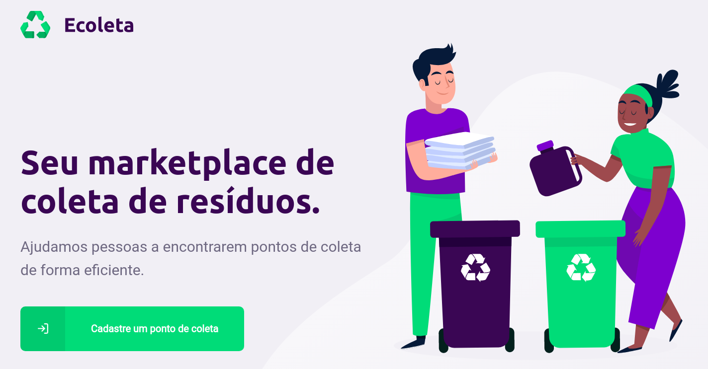
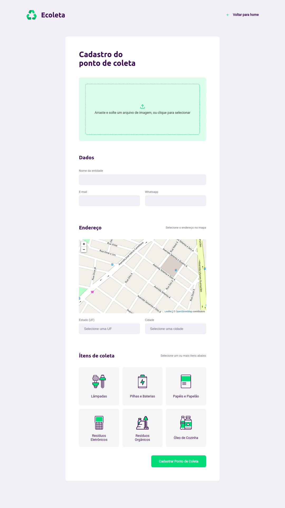

<h1 align="center">
  
</h1>

<h3 align="center">
  Desafio Next Level Week: Ecoleta 
</h3>

Aplicação completa (back-end, web e mobile) de um marketplace de locais de coleta de resíduos chamado Ecoleta, codado durante a primeira edição da Next Level Week da Rocketseat.

## Sobre o desafio

**Ecoleta** é uma aplicação responsável por um marketplace que cadastra locais que coletam resíduos e depois permite que os mesmos sejam localizados em um mapa.

O cadastro dos locais são feitos através de uma interface web. No cadastro o usuário deve fornecer uma imagem do local (recurso 'drag and drop' disponível); dados do local como nome, e-mail, whatsapp, cidade e estado (informações adquiridas através da própria API do IBGE), o endereço exato (indicado através de um marcador no mapa), e os tipos de coleta disponíveis.

No aplicativo móvel é possível que o usuário localize todos os locais disponíveis na sua região, filtrados de acordo com a categoria de coleta desejada, e obter as informações do local - além de conseguir mandar um e-mail ou mensagem de whatsapp diretamente.

## Tecnologias

Esse projeto foi desenvolvido com as seguintes tecnologias:

- [Node.js](https://nodejs.org/en/)
- [React](https://reactjs.org)
- [React Native](https://facebook.github.io/react-native/)
- [Expo](https://expo.io/)

## Resultado:

**MOBILE**

  

**WEB**

  
  

## Back-end

Para executar o back-end é preciso acessar, via terminal, a pasta `backend` e executar o comando `yarn dev` para rodar a API.

## Web

Para executar a aplicação web você deve acessar, via terminal, a pasta `web` e executar: `yarn start`.

## Mobile (somente Android)

Para executar a aplicação Mobile você deve acessar, via terminal, a pasta `mobile` e seguir os seguintes passos:

**1.** Configurar o arquivo `mobile/src/services/api.js` com ip correto (vide observações abaixo) para que a aplicação consiga acessar a api.

**Obs1:** Se você for rodar a aplicação no AndroidStudio, o ip deve ser `'10.0.0.2'`; se for no geneMotion, `'10.0.3.2'`; e se for com o aparelho físico via usb, deve ser o ip da sua máquina.

**Obs2:** Se a aplicação não estiver conseguindo acessar a api, faça o remapeamento de porta com o comando: `adb reverse tcp:3334 tcp:3334`.

**2.** Agora rode a aplicação com o comando `yarn start`;

**3.** Instalar o aplicativo Expo no celular e escanear o QR-CODE disponível na tela do navegador.

